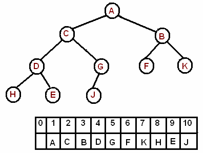

# Directed Graph

## Directed Acyclic Graph

* It is simply a directed graph which contains no cycles - it is impossible to start at one vertex, move along a sequence of arcs and end up in the same vertex

<figure><figcaption>
Directed Acyclic Graph
</figcaption></figure>

* Every DAG has at least one Topological Ordering.


## Sink Vertex

Sink vertex is the vertex which has no outbound edges.&#x20;


* A DAG has to have at least one **sink vertex**.  If we don’t have a sink vertex then that means that every edge will have at least one outgoing vertex and since we have finite vertices in our graph then by _**pigeon hole principle**_ that means that, we will be visiting one of the already visited vertices, which implies we would have a directed  cycle.


A directed graph with no sink vertex must have cycle.


### Dynamic programming

*   If a directed graph is acyclic, dynamic programming can be applied to it.

    We can efficiently solve the following problems concerning paths from a starting node to an ending node

    * how many different paths are there?
    * what is the shortest/longest path?
    * what is the minimum/maximum number of edges in a path?&#x20;
    * which nodes certainly appear in any path?

## References&#x20;

* [Directed graphs chapter from "Competitive Programmer’s Handbook"](https://usaco.guide/CPH.pdf#page=159)

