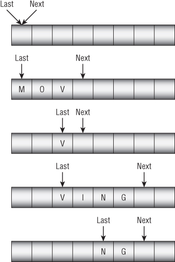
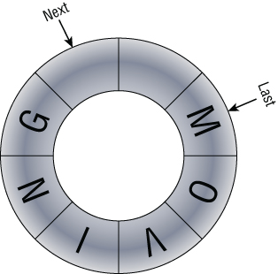

# Queue

A queue is a data structure where items are added and removed in first-in-first-out order. Because of this first-in-first-out (FIFO, usually pronounced “fife-oh”) behavior, stacks are sometimes called FIFO lists or FIFOs.

<figure><figcaption></figcaption></figure>

The method that adds an item to a queue is called `Enqueue`, and the item that removes an item from a queue is called `Dequeue`.

## Linked-List Queues 

The `Enqueue` method simply adds a new cell to the top of the list, and the `Dequeue` method removes the bottom cell from the list.

<mark style="background-color:yellow;">To make removing the last item from the queue easy, the queue should use a doubly linked list.</mark> With a doubly linked list, enqueueing and dequeueing items have $$\text{O}(1)$$ run times.

## Array Queues 

To keep track of the array positions that are in use, use two variables:&#x20;

* `Next`, to mark the next open position
* `Last`, to mark the position that has been in use the longest

If we simply store items at one end of an array and remove them from the other, however, the occupied spaces move down through the array.

<figure><figcaption></figcaption></figure>

A more effective approach is to build a _circular array_, in which we treat the last item as if it were immediately before the first item. Now when `Next` falls off the end of the array, it wraps around to the first position, and the program can store new items there.

<figure><figcaption></figcaption></figure>

Since when the queue is empty, `Next` is the same as `Last` and in case of full queue `Next` goes all the way around the array and catches up to `Last` , so there's no obvious way to tell whether the queue is empty or full. Solution are to

* track the number of items in the queue
* keep track of the number of unused spaces in the queue,&#x20;
* keep track of the number of items added to and removed from the queue

If the queue is full and to add more items, allocate a larger storage array, copy the data into the new array, and then use the new array instead of the old one.

