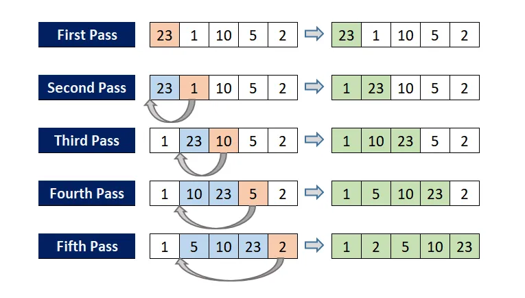

# Insertion Sort

The basic idea is to take an item from the input list and insert it into the proper position in a sorted output list (which initially starts empty).

<figure><figcaption></figcaption></figure>
