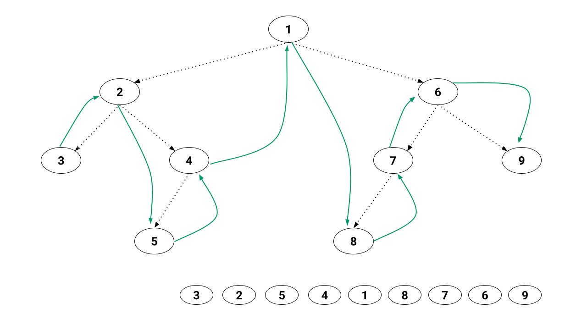
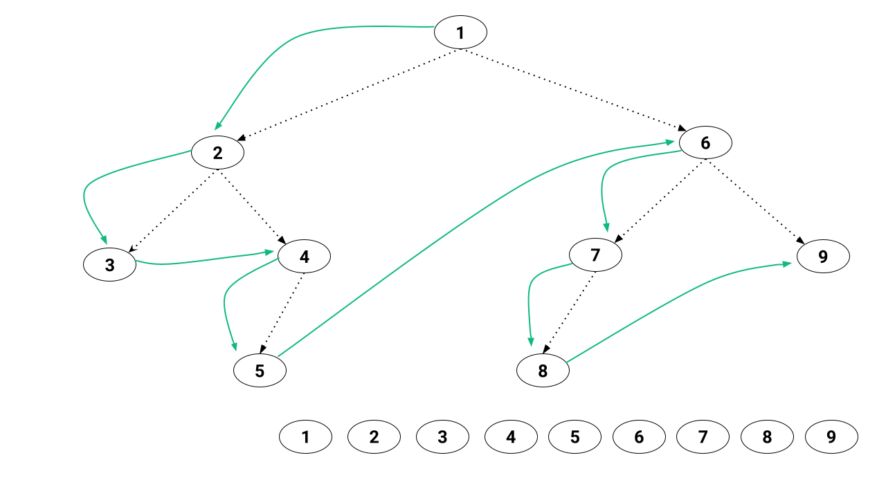
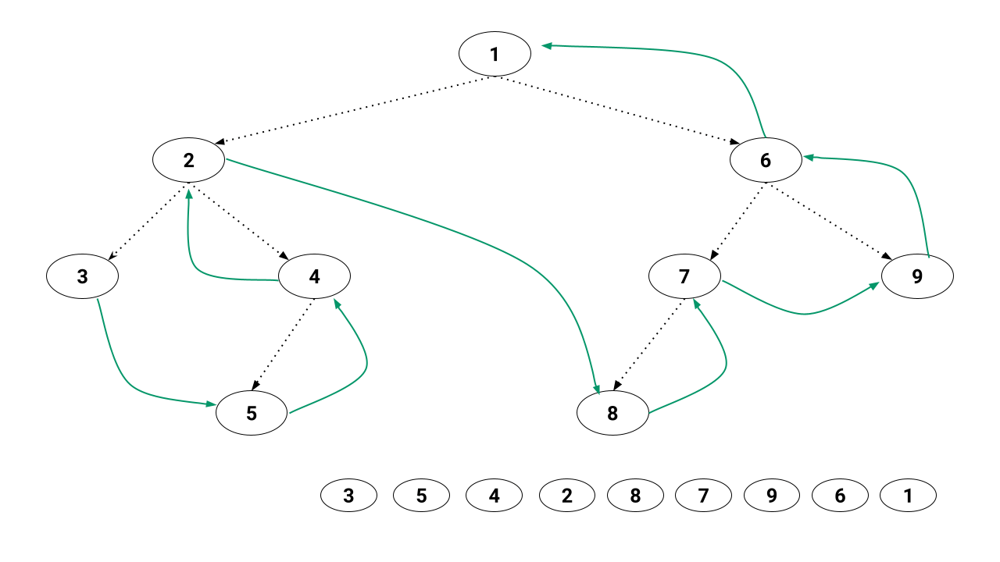
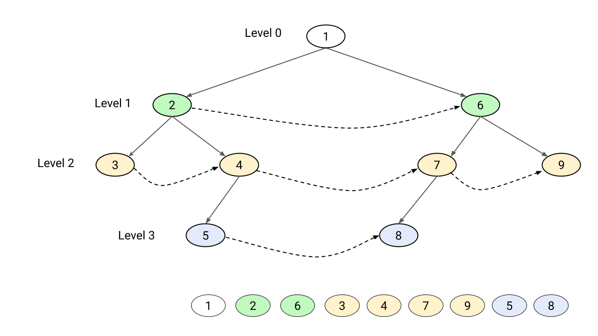

# Binary Tree Traversal

* The process of visiting all nodes of a tree is called tree traversal
* Traversing a binary tree requires traversal of each component&#x20;
  * Processing root node
  * traversing the left subtree
  * traversing the right subtree



&#x20;Sometimes reverse traversals also helps to solve several binary tree coding problems.


## Morris In-order Traversal  (root second)&#x20;

Traverse from the **left** subtree to the **root** then to the **right** subtree.

<figure><figcaption></figcaption></figure>

In the _inorder traversal_, the root is visited after visiting its left subtree but before visiting the right subtree.

```java
void inOrderTraversal(Node root)
{
  if (root == null)return;
  
  inOrderTraversal(root.left);
  System.out.println(root.name);
  inOrderTraversal(root.right);
}
```

#### Use cases

* In a **binary search tree** to get the nodes in non-decreasing order

## Pre-order Traversal  (root first)


<figure><figcaption></figcaption></figure>

In the _preorder traversal_, the root is visited before the left and right subtrees are visited (in that order).\


```java
void preOrderTraversal(Node root)
{
  if (root == null)return;
  
  System.out.println(root.name);
  inOrderTraversal(root.left);
  inOrderTraversal(root.right);
}
```

#### Usecase

* To explore the root before the leaves
* To get get prefix expression of the tree

## Post-order Traversal (root last)

First process all nodes in the left subtree, then process all nodes in the right subtree, and at the end, we process the root node.


<figure><figcaption></figcaption></figure>


In the _postorder traversal_, the root is visited after visiting the left and right subtrees (in that order).

```java
void postOrderTraversal(Node root)
{
  if (root == null)return;
  
  inOrderTraversal(root.left);
  inOrderTraversal(root.right);
  System.out.println(root.name);
}
```

#### Usecase

* For deleting the entire binary tree
* To get the post-fix expression of the tree


## Level-order Traversal (BFS)&#x20;

Start by processing the root node, then process all nodes at the first level, second level, and so on.&#x20;

<figure><figcaption></figcaption></figure>

Explore all nodes at the current level before moving on to nodes at the next level.


## References

* [Binary tree traversal](https://www.brainkart.com/article/Binary-Tree-Traversals-and-Related-Properties\_8024/)
* [Recursive Binary Tree Traversals: Preorder, Inorder and Postorder](https://www.enjoyalgorithms.com/blog/binary-tree-traversals-preorder-inorder-postorder)
* [Level Order (Breadth First Search) Traversal of Binary Tree](https://www.enjoyalgorithms.com/blog/level-order-traversal-of-binary-tree)
